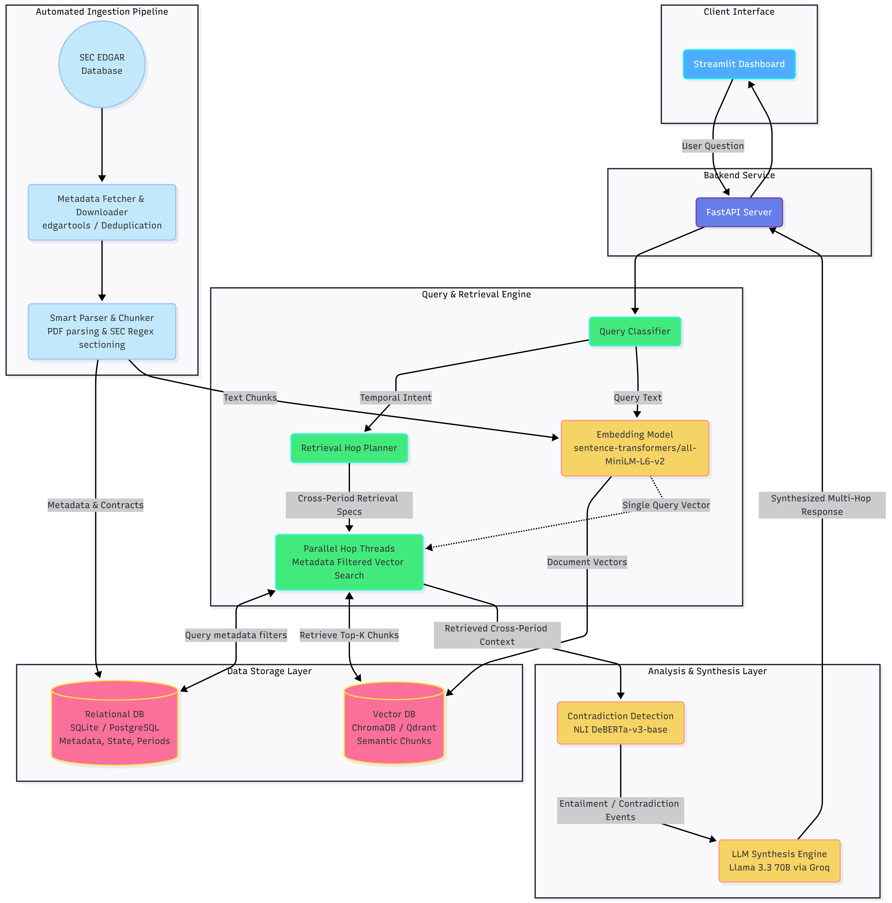

# SEC Filing Multi-Hop RAG System

An AI-powered financial research tool that enables analysts to ask complex, temporally-aware questions across multiple SEC EDGAR quarterly and annual filings and receive grounded, cited answers — with automatic NLI-based contradiction detection.


---

## Architecture



---

## Setup

```bash
git clone https://github.com/Vardhanch05/sec-multi-hop-rag
cd sec-rag-system
python -m venv venv
source venv/bin/activate  # Windows: venv\Scripts\activate
pip install -r requirements.txt
cp .env.example .env
# Fill in GROQ_API_KEY and other values in .env
```

---

## Usage

```bash
streamlit run ui/app.py
```

---

## Evaluation

```bash
pytest tests/ -v
python evaluation/ragas_harness.py
```

---

## Tech Stack

- **LLM**: Llama 3.3 70B via Groq API (fallback: llama-3.1-8b-instant)
- **Embeddings**: sentence-transformers/all-MiniLM-L6-v2
- **Contradiction detection**: cross-encoder/nli-deberta-v3-base
- **Vector DB**: ChromaDB (dev) / Qdrant Cloud (prod)
- **Relational DB**: SQLite (dev) / PostgreSQL (prod)
- **Frontend**: Streamlit
- **Evaluation**: RAGAS
